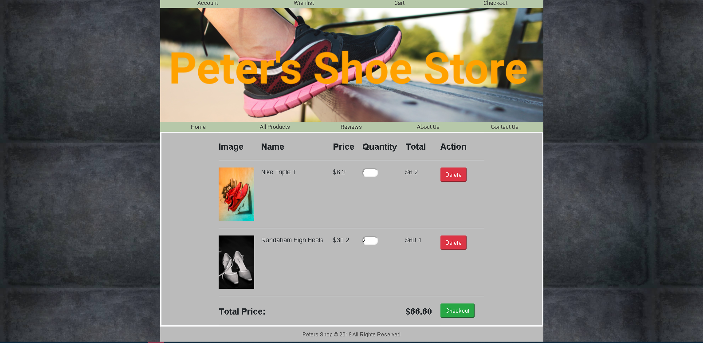

# 👞👞Peter's Shoe Store👟👟
> Online store for selling shoes.

## Features

- Vanilla JS
- Shopping cart (Local storage)
- Clean CSS

---

## Screenshots

- Home Page

- All Products Page

- Single Product Page

- Cart Page

- Contact Us Page

---

## License

- **[MIT license](http://opensource.org/licenses/mit-license.php)**
- Copyright 2020 © <a href="https://github.com/teafoot" target="_blank">teafoot</a>